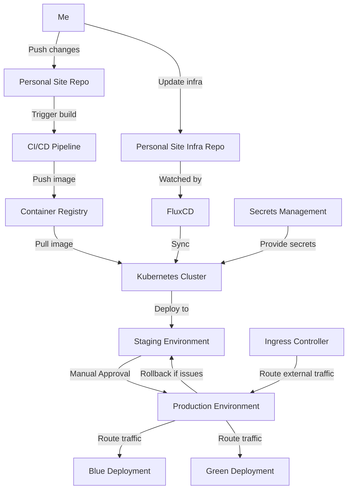

<p align="center">
  
</p>

# Personal Site Infrastructure (WIP)

<p align="left">
    
</p>

<p align="left">
  <a href="#introduction">Introduction</a> •
  <a href="#features">Features</a> •
  <a href="#technical-details">Technical Details</a> •
  <a href="#development-and-deployment">Development and Deployment</a> •
  <a href="#future-improvements">Future Improvements</a> •
  <a href="#license">License</a> •
  <a href="#contributing">Contributing</a> •
  <a href="#contact">Contact</a>
</p>

## Introduction

Infrastructure-as-code for my personal website ([Github](https://github.com/zaneriley/personal-site)). It uses Kubernetes and FluxCD  for continuous deployment and infrastructure management. It's an over the top way to launch what is essentially a static website. B

**Why all this for a website?**
- It's a personal website, so why not? It's one of the few times you can build what you want without compromises. 
- It'll be reusable for future app development
- This is also a homelab project. 

## Features

- GitOps-based infrastructure management using FluxCD
- Separate configurations for staging and production
- For production, it uses blue/green deployments



## Installation

<p align="left">
  
  
  
</p>


### Prerequisites

- Kubernetes cluster
- kubectl configured to access your cluster
- FluxCD installed on your cluster

### Setup

1. Clone the repository:
```bash
git clone https://github.com/zaneriley/personal-site-infra.git
```

2. Set up kubeseal on your local machine. For example, on Ubuntu:
```bash
wget https://github.com/bitnami-labs/sealed-secrets/releases/download/v0.18.0/kubeseal-0.18.0-linux-amd64.tar.gz
tar -xvzf kubeseal-0.18.0-linux-amd64.tar.gz kubeseal
sudo install -m 755 kubeseal /usr/local/bin/kubeseal
```

2. Update the `personal-site.yml` file with your correct image registry and version.

3. Apply the FluxCD configuration:
```bash
kubectl apply -f kubernetes/flux-systems/flux-system.yml
```

4. FluxCD will automatically sync the repository and apply the configurations.


## License

This project is licensed under the MIT License. See the [LICENSE](LICENSE) file for details.

## Contact

Zane Riley - [GitHub](https://github.com/zaneriley)

Personal Site - [GitHub](https://github.com/zaneriley/personal-site) [Website](https://zaneriley.com)

Project Link: [https://github.com/zaneriley/personal-site-infra](https://github.com/zaneriley/personal-site-infra)
