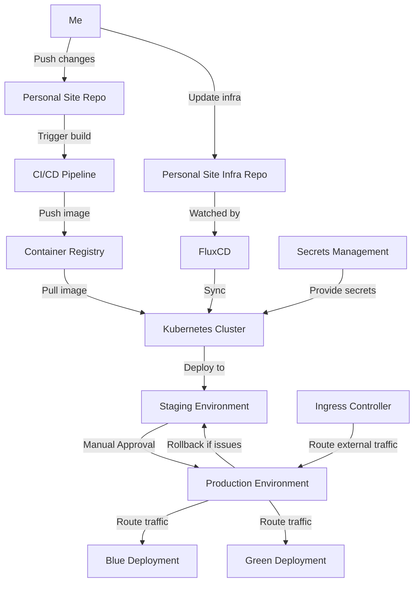

<p align="center">
  
</p>

# Personal Site Infrastructure (WIP)

<p align="left">
    
</p>

<p align="left">
  <a href="#introduction">Introduction</a> •
  <a href="#features">Features</a> •
  <a href="#getting-started">Getting Started</a> •
  <a href="#future-improvements">Future Improvements</a> •
  <a href="#license">License</a> •
  <a href="#contributing">Contributing</a> •
  <a href="#contact">Contact</a>
</p>

## Introduction

Infrastructure-as-code for my personal website ([Github](https://github.com/zaneriley/personal-site)). It uses Kubernetes and FluxCD  for continuous deployment and infrastructure management. It's an over the top way to launch what is essentially a static website. B

**Why all this for a website?**
- It's a personal website, so why not? It's one of the few times you can build what you want without compromises. 
- It'll be reusable for future app development
- This is also a homelab project. 

## Features

- GitOps-based infrastructure management using FluxCD
- Blue/green deployments with ability to switch to canary deployments

The deployment process looks like this (you'l need to view this on Github.com to see the diagram):



## Installation

<p align="left">
  
  
  
</p>

### Local setup

1. Clone the repository:
  ```bash
  git clone https://github.com/zaneriley/personal-site.git
  ```
  
1. Adjust the `scripts/install-setup.sh` file with your correct image registry and version.

1. Run the setup script on your local machine to install the required tools:
  ```bash
    ./run setup <GITHUB_USER>
  ```
  You'll be prompted to enter your GitHub personal access token to enable FluxCD to access your repositories.

1. Set up secrets using Bitnami's Sealed Secrets:
   a. Create a regular Kubernetes secret YAML file locally:

    ```yaml
    apiVersion: v1
    kind: Secret
    metadata:
    name: personal-site-secrets
    namespace: personal-site
    type: Opaque
    stringData:
        SECRET_KEY_BASE: your_secret_key_base
        DEV_TOKEN_SALT: your_dev_token_salt
        PROD_TOKEN_SALT: your_prod_token_salt
        POSTGRES_PASSWORD: your_postgres_password
    ```
a. Use kubeseal to encrypt the secret:
   
   ```bash
   kubeseal --format=yaml < secret.yaml > secret.sealed.yaml
   ```
b. Commit and push the `sealed-secret.yaml` file to the repository.

1. Apply the FluxCD configuration:
```bash
kubectl apply -f kubernetes/flux-systems/flux-system.yaml
```
You can run this to check if everything is working:
```bash
flux get kustomizations
flux get sources git
flux get images all
```
6. FluxCD will automatically sync the repository and apply the configurations.


## Usage
1. Apply the Kubernetes manifests:
  ```bash
  kubectl apply -f namespace.yaml
  kubectl apply -f deployments.yaml
  kubectl apply -f service-canary.yaml
  kubectl apply -f ingress.yaml
  ```
1.Verify the resources are created
  ```bash
  kubectl get all -n personal-site
  kubectl get ingress -n personal-site
  ```
1.Test accessing the app
   - Add `personal-site.local` to your `/etc/hosts` file, pointing to your cluster IP
   ```bash
   echo "127.0.0.1 personal-site.local" | sudo tee -a /etc/hosts
   ```
   - Type `   kubectl port-forward -n ingress-nginx service/ingress-nginx-controller 8080:80`. This command forwards port 80 of the ingress controller to port 8080 on your local machine.
   - Open a browser and navigate to `http://personal-site.local:8080`
   - Verify you see the "Green Version" message

1. Test blue/green switch:
  ```bash
  ./scripts/switch-deployment.sh
  ```

1. Verify the switch:
```bash
  kubectl get ingress personal-site -n personal-site -o jsonpath='{.spec.rules[0].http.paths[0].backend.service.name}'
  ```

  This should now return `personal-site-blue`.

7. Refresh your browser and verify you see the "Blue Version" message.

8. Test canary deployment:
  ```bash
  ./scripts/canary-deploy.sh 20
  ```

1. Verify the canary deployment:
  ```bash
  kubectl get ingress personal-site-canary -n personal-site -o jsonpath='{.spec.rules[0].http.paths[0].backend.service.name}'
  ```
  This should return 20

1. Refresh your browser multiple times. You should see the "Blue Version" message about 80% of the time.

1. Increase the weight to 100 and refresh your browser. You should see the "Green Version" message.

1. Verify the main ingress has switched. 
  ```bash
  kubectl get ingress personal-site -n personal-site -o jsonpath='{.spec.rules[0].http.paths[0].backend.service.name}'
  ```
  This should return `personal-site-green`.

1. Test rollback:
  ```bash
  ./scripts/switch-deployment.sh
  ```

1. Verify the switch:
  ```bash
  kubectl get ingress personal-site -n personal-site -o jsonpath='{.spec.rules[0].http.paths[0].backend.service.name}'
  ```

  This should now return `personal-site-blue`.

1. Cleanup
  ```bash
  kubectl delete namespace personal-site
  ```

## License

This project is licensed under the MIT License. See the [LICENSE](LICENSE) file for details.

## Contact

Zane Riley - [GitHub](https://github.com/zaneriley)

Personal Site - [GitHub](https://github.com/zaneriley/personal-site) [Website](https://zaneriley.com)

Project Link: [https://github.com/zaneriley/personal-site](https://github.com/zaneriley/personal-site)
